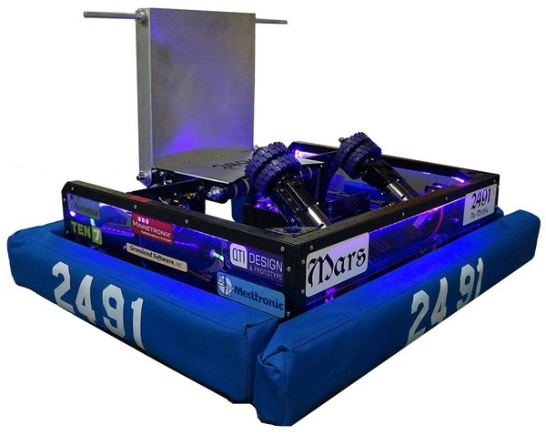

# FIRST Robotics Compititon
## What I did
From grade 8-12 I was on FRC. strating in my second year I began takeing on leadership, helping to integrate CAD into team for the first time and running control systems including the teams first time useing CAN. While doing CAD I worked with our sheetmetal suplier to switch the team to useing a unibody sheet metal chaisis reducing frame compnents from ~40 to just 3 (unibody and 2 machined sub frames for drive componenet mounting). The first set of images is from that first year where I was responsible for chaisis and control system. The second is from my last year where I was team capitain and manged the robotot as a whole with a team of 7 people.  in addition find download links for CAD models below. https://grabcad.com/library/oriole-robotics-2017-1/details?folder_id=2711575

