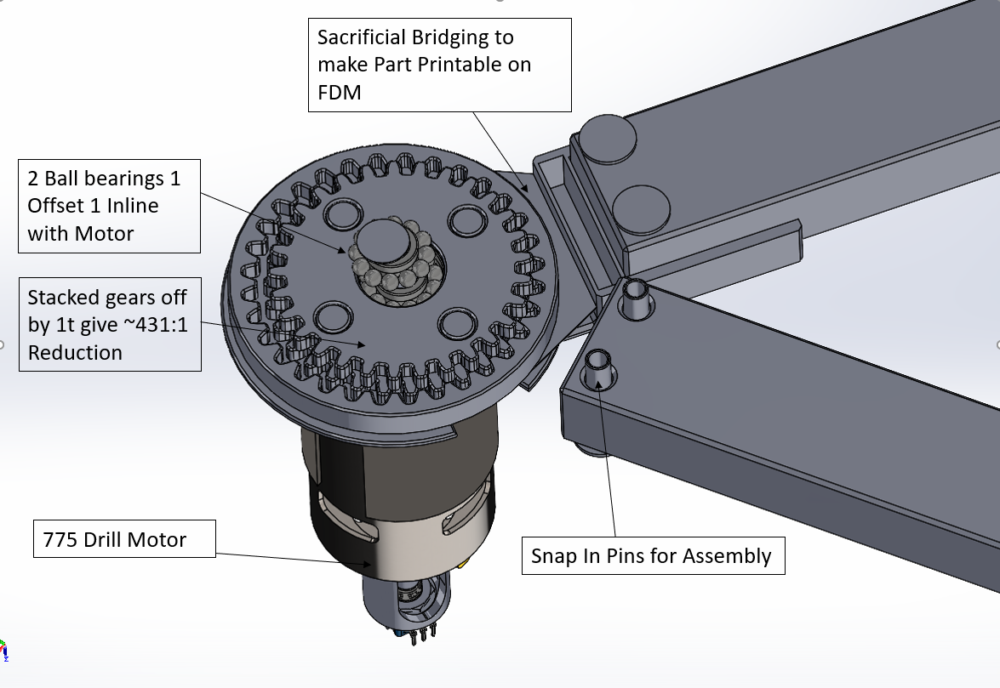
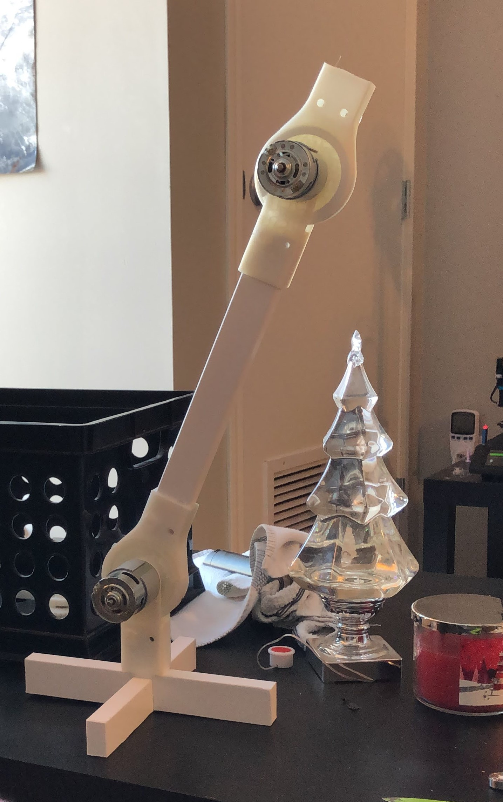

# Personal Projects
## What I did
This past winter I attempted to make a high torque simple robotic join that could be made with injection molded plastic and use cheap mechanical encoders. My goal was a join capable of 100lb-ft torque, positioned to within 1deg and a BOM cost of less than $20 when mass manufactured.  I achieved the torque and theoretical cost by using a back-to-back eccentric gear set powered by a 775 style drill motor. However, the positioning proved too difficult to achieve with the $0.82 cent encoders ordered directly from Alibaba. 
## What I learned
1. Even in a mechanical project thinking through control systems is important
2. FDM printing is not magic, and any parts made with it should be designed with it in mind from the beginning.
3. Plastic on plastic sliding is a bad idea if speeds get even moderately fast.
 

